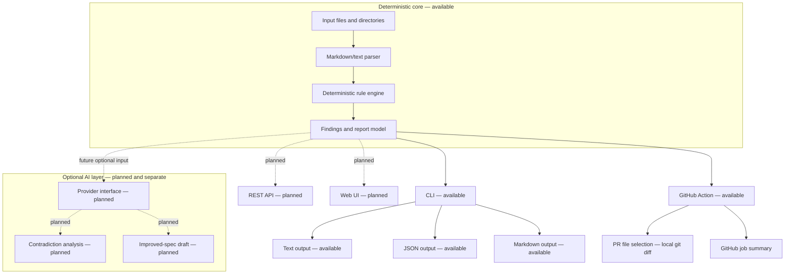

# Architecture

SpecForge Gate is deterministic-first. The implemented core reads local input, parses it, runs deterministic rules, and emits structured reports through the current CLI outputs. The available GitHub Action and planned interfaces call the same core without adding network or provider dependencies to it.

## Available flow

1. The CLI receives one or more local files or directories.
2. Directory inputs expand to Markdown, Markdown-like, and text files.
3. The parser extracts sections and lines for deterministic analysis.
4. Rules emit findings with stable IDs, severity, location, explanation, and suggested correction.
5. The report model renders text, JSON, or Markdown output.
6. Exit codes are controlled by `--fail-on` and remain compatibility-sensitive.

## GitHub Action interface

The reusable composite action is an available interface layer. It provisions Python, installs the package from the action checkout, selects pull-request Markdown changes with a local three-dot `git diff`, applies project configuration, runs the deterministic engine, and writes a Markdown job summary. It requires no API-write token and does not send specification content outside the runner.

The REST API and web UI remain planned interface layers and must not be described as available.

## Optional AI boundary

Optional AI analysis is planned for later releases. It must remain visually and architecturally separate from the deterministic core, and it must not change stable rule IDs, current output contracts, or exit-code semantics.

## Related details

The older [architecture overview](architecture/overview.md) remains a concise internal summary and should align with this public entry point.
