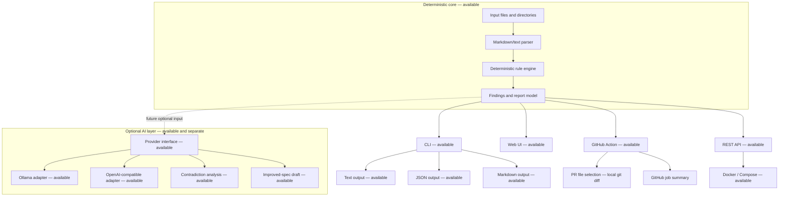

# Architecture

SpecForge Gate is deterministic-first. The implemented core reads local input, parses it, runs deterministic rules, and emits structured reports through the current CLI outputs. The available GitHub Action, REST API, web UI, and container deployment preserve the same core boundary without adding network or provider dependencies to it.

## Available flow

1. `specgate check` receives one or more local files or directories.
2. Directory inputs expand to Markdown, Markdown-like, and text files.
3. The parser extracts sections and lines for deterministic analysis.
4. Rules emit findings with stable IDs, severity, location, explanation, and suggested correction.
5. The report model renders text, JSON, or Markdown output.
6. Exit codes are controlled by `--fail-on` and remain compatibility-sensitive.
7. `specgate ai-review` accepts one explicit file, produces the same deterministic report first, then explicitly invokes the environment-configured provider for advisory contradictions and drafting.

## GitHub Action interface

The reusable composite action is an available interface layer. It provisions Python, installs the package from the action checkout, selects pull-request Markdown changes with a local three-dot `git diff`, applies project configuration, runs the deterministic engine, and writes a Markdown job summary. It requires no API-write token and does not send specification content outside the runner.

## REST API interface

The optional REST API is an available stateless interface layer. Its `POST /v1/check` path accepts inline text, maps validated inline rule configuration into the existing `ProjectConfig`, calls the same `analyze_text()` core, and returns the existing structured report contract without provider I/O. Server-side AI configuration can additionally enable explicit `GET /v1/ai/status` and `POST /v1/ai/review` endpoints. The review endpoint runs deterministic analysis first, then advisory contradiction analysis and conservative drafting through one configured provider. It never accepts request-selected filesystem paths, URLs, provider URLs, or credentials from the request body. FastAPI/Uvicorn remain optional interface dependencies and are not dependencies of the deterministic core.

## Web UI interface

The web UI is an available same-origin interface served by the optional FastAPI process at `/`. It is a self-contained HTML/CSS/JavaScript page with no frontend build toolchain or external runtime assets. Deterministic **Analyze requirements** calls only `/v1/check`. The page separately reads non-secret provider availability from `/v1/ai/status` and enables explicit **AI Review** through `/v1/ai/review`; contradictions and the conservative draft are rendered with DOM text nodes, and draft application requires a separate user action. This adds no dependency or behavior to the deterministic core.

## Container interface

The Docker image and one-service Compose deployment package the existing FastAPI process rather than creating a new product service. The container serves the same REST API and web UI, runs as a non-root user, and relies on the existing `/healthz` endpoint. Compose binds to loopback by default and adds a read-only root filesystem, ephemeral `/tmp`, dropped capabilities, and `no-new-privileges`. The container layer adds no persistence, database, reverse proxy, authentication, or provider dependency.

## Optional AI boundary

The provider-neutral AI contract, `OllamaProvider`, `OpenAICompatibleProvider`, advisory contradiction analysis, conservative improved-spec drafting, and server-side provider resolver are available under `specforge_gate.ai`. They remain separate from the deterministic core. Provider network I/O occurs only when optional AI code is explicitly invoked; no deterministic check imports or calls it. The REST `/v1/ai/review` endpoint and `specgate ai-review` are explicit product-surface orchestrators over these contracts, while `/v1/check` and `specgate check` remain provider-free. Contradiction results are validated against verbatim source substrings; improved-spec drafts are bounded human-reviewable Markdown outputs. Neither feature can alter SG rule findings, deterministic report formats, PASS/NEEDS WORK, or exit-code semantics. See [`cli-ai-review.md`](cli-ai-review.md), [`rest-api.md`](rest-api.md), [`ai-provider-interface.md`](ai-provider-interface.md), [`ollama.md`](ollama.md), [`openai-compatible.md`](openai-compatible.md), [`contradiction-analysis.md`](contradiction-analysis.md), and [`improved-spec-draft.md`](improved-spec-draft.md).

## Related details

The older [architecture overview](architecture/overview.md) remains a concise internal summary and should align with this public entry point.
