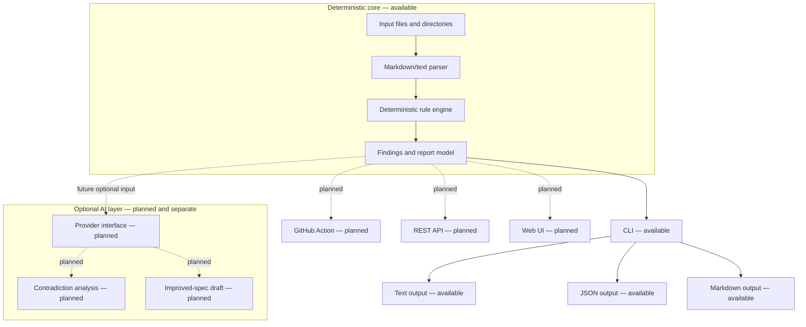

# Architecture

SpecForge Gate is deterministic-first. The implemented core reads local input, parses it, runs deterministic rules, and emits structured reports through the current CLI outputs. Planned interfaces must call the same core without adding network or provider dependencies to it.

## Available flow

1. The CLI receives one or more local files or directories.
2. Directory inputs expand to Markdown, Markdown-like, and text files.
3. The parser extracts sections and lines for deterministic analysis.
4. Rules emit findings with stable IDs, severity, location, explanation, and suggested correction.
5. The report model renders text, JSON, or Markdown output.
6. Exit codes are controlled by `--fail-on` and remain compatibility-sensitive.

## Planned interfaces

The planned GitHub Action, REST API, and web UI are interface layers only. They are not implemented in the current repository state and must not be described as available in public materials.

## Optional AI boundary

Optional AI analysis is planned for later releases. It must remain visually and architecturally separate from the deterministic core, and it must not change stable rule IDs, current output contracts, or exit-code semantics.

## Related details

The older [architecture overview](architecture/overview.md) remains a concise internal summary and should align with this public entry point.
